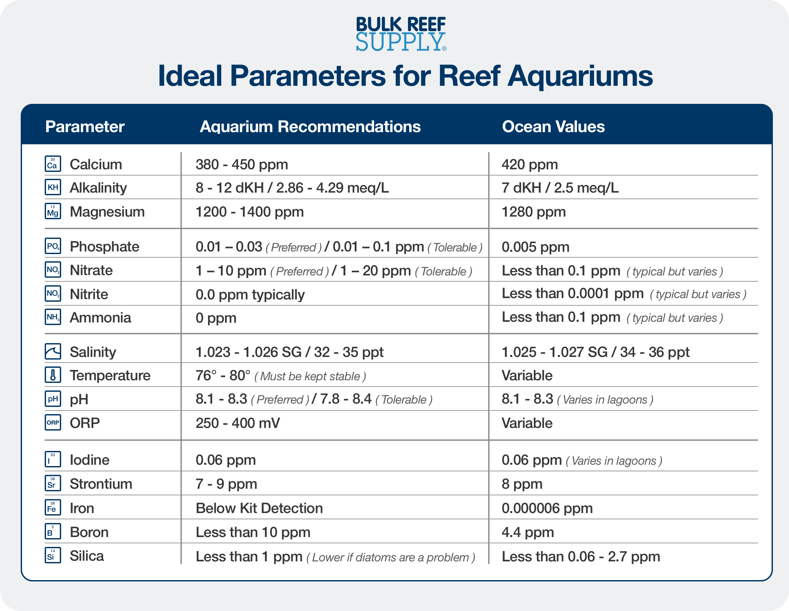

## Overview

My first two marine science projects were built on a single variable: thermal stress.
The [first project](bleaching-risk-notebook.html) — a historical analysis of NOAA Coral
Reef Watch Degree Heating Weeks across five reef sites — asked what happened during past
bleaching events. The [second project](el-nino-watch-2026.html) — a live daily monitor
across seven sites during the 2026 El Niño period — asked what is happening right now.
Both are DHW pipelines. Both are useful. Neither can see what DHW cannot see.

About halfway through building the El Niño watch, something from clinical informatics
started nagging at me. A creatinine of 2.1 mg/dL is a number. It means something very
different in a 25-year-old with no prior history than in a 70-year-old on nephrotoxic
medications with a baseline of 1.8 three months ago. The value only becomes clinically
meaningful when you combine it with a trajectory, a history, a set of modulating factors,
and an understanding of the mechanism. A DHW value works the same way. Two reefs at
identical DHW can have very different bleaching outcomes depending on how much light is
hitting them, how turbid the water is, whether they have bleached before, and what their
thermal history has trained them to tolerate. The single-stream pipeline cannot see any
of that.

This project is the attempt to build something more useful: a **regression-based,
multi-factor coral bleaching risk score** with a dependent variable rooted in published
field survey data and independent variables drawn from multiple environmental data
sources — satellite products, in-situ monitoring networks, and gridded climatologies —
combined at the site level. The MVP scope targets a tractable set of predictors chosen
for data availability and published precedent, but the predictor space in the literature
runs considerably wider: @safaie2018 used 20 in-situ variables plus 7 SST metrics
across 81 bleaching events; @munizcastillo2024 used 23 stress exposure and sensitivity
metrics in the Mesoamerican Reef alone. This project is designed to be extended, not
exhaustive on the first pass.

The goal is not a global daily map. Reef conservation operates under real resource
constraints — limited funding, limited personnel, limited political capital to establish
protections. The question a reef manager, conservation program, or funding body actually
needs answered is not *is somewhere in the ocean bleaching right now* but *which sites
are most at risk this season, and why* — so that protection, intervention, or research
resources can be directed where they will matter most. A risk score that names the
driving inputs is actionable in a way that a DHW threshold alert is not. Whether that
action is emergency no-take design, targeted sunscreen intervention, or a grant
application for restoration work — the decision needs to know the cause.

::: {.callout-note appearance="simple"}
**Document status:** This is a design document, not an analysis. MVP code cells
throughout make the methodology concrete rather than aspirational. None execute here —
all are marked `#| eval: false`. The implementation notebook follows after this one
earns the right to it.
:::

---

## The Literature Landscape

Before designing a model it is worth understanding what the field has already built.
Risk scoring for coral bleaching has been an active research program for about two
decades and the methodological space is wider than it first appears. What follows is not
a comprehensive review — it is a map of the work that has directly shaped the design
decisions in this document, organized into four loose clusters.

### 1. NOAA Coral Reef Watch and the temperature-only baseline

The default baseline against which everything else is compared is the CRW operational
suite — HotSpot, DHW, Bleaching Alert Area — built on the CoralTemp SST record and the
Maximum Monthly Mean climatology [@skirving2020; @liu2014]. These products are the
global standard and they work. @heron2016 published the canonical 5km validation,
demonstrating that the 5km products substantially outperform the legacy 50km heritage
products against in-water bleaching surveys.

What is less widely appreciated is that CRW already operates experimental products that
go beyond temperature alone. The Light Stress Damage (LSD) product suite explicitly
combines temperature and light into a single stress index based on the photoinhibition
mechanism [@skirving2018]. CRW also publishes an experimental Four-Month Coral
Bleaching Outlook — updated weekly, forecasting the probability of bleaching-level heat
stress using SST projections from NOAA's CFSv2 ensemble [@liu2018]. The CRW Thermal
History product suite provides pre-aggregated annual thermal metrics per pixel back to
1985. A reasonable question at this point is: if NOAA is already publishing multi-factor
experimental products, what is the point of building my own? The answer is that CRW's products are designed for global
operational monitoring — daily maps, management alerts. What I am building is different:
a regression-based, site-and-survey-level risk score with the dependent variable rooted
in published bleaching outcome datasets and the independent variables combined at the
analysis site level. That is a different artifact than a global daily map, aimed at a
different question.

### 2. The in-situ statistical models

A second body of work approaches the problem from the field-survey side rather than the
satellite side. This is the cluster I have returned to most often.

@safaie2018 fit ordinal logistic regression models to 81 bleaching events across five
major reef regions using 20 in-situ environmental variables and 7 remotely sensed SST
metrics — 10,367 model permutations in total. The finding is now well known:
high-frequency temperature variability is the single most predictive covariate, and it
has a *mitigating* effect. A 1°C increase in daily temperature range reduces the odds of
more severe bleaching by a factor of 33. That result directly shapes how I am thinking
about the thermal variability predictor in this project.

@sully2020 used a Bayesian model on 8,797 Reef Check surveys across 81 countries and
found that Kd490 values in a specific moderate turbidity range are associated with
reduced bleaching during thermal stress events — about 12% of the world's reefs sit in
this protective window. @donovan2021 showed that nitrogen pollution interacts with heat
stress to double bleaching severity at intermediate stress levels across 223 sites
globally. @munizcastillo2024 fit a boosted regression tree to bleaching observations in
the Mesoamerican Reef using 23 stress metrics and predicted 75% of the variation in
bleaching severity — the most spatially proximate prior art for four of my five
Caribbean study sites.

### 3. Machine learning and explainable ML

In my primary field — clinical and biomedical informatics — ML methods like random
forests and gradient boosting have become standard tools for risk prediction. The coral
bleaching literature is moving in the same direction. @cheung2025 applied a spatially
cross-validated ordinal random forest to 2,643 bleaching outcomes on the Great Barrier
Reef across the 2016, 2017, and 2020 events. @kiefer2025 used gradient-boosted random
forests to forecast heat stress onset on Florida's Coral Reef. Both studies used SHAP
values — a method for decomposing a model's predictions into per-variable contributions
— to make their black-box models interpretable after the fact. I understand the appeal,
but I am not starting there. ML methods are tools I want to earn the right to use after
there is a working regression baseline that can be explained from first principles.

### 4. Thermal adaptation — the part I find most interesting

The smallest cluster but the one that connects most directly to what I already know
from reef tank keeping. @palumbi2014 showed in reciprocal transplant experiments that
*Acropora hyacinthus* — a genus any SPS keeper will recognize — colonies from thermally
variable microhabitats had measurably higher thermal tolerance than colonies from nearby
stable habitats, and that transplanted colonies acquired the same tolerance in less than
two years. @lachs2023 estimated a roughly 0.1°C per decade emergent increase in thermal
tolerance in remote Pacific reef assemblages.

The mechanism is genuinely contested. The candidates are: selection pressure eliminating
thermally sensitive genotypes over successive bleaching events; acclimatization across
the entire coral holobiont — the coral animal plus its Symbiodiniaceae symbionts plus
the bacteria, archaea, and other microorganisms that live in and on the coral tissue as
an integrated system; or community-level shifts toward thermally tolerant symbiont clades
like *Durusdinium* [@palaciocastro2023]. As a reef keeper the holobiont framing clicked
for me when I thought about it this way: the bleaching you see when a tank runs too warm
is the coral expelling its symbionts — the animal and the algae separating under stress.
The holobiont is the whole system under normal conditions. Whether a reef can adapt
depends on whether that whole system can reorganize faster than the thermal baseline is
rising.

What matters for this project is that if thermal variability is a meaningful proxy for
cumulative adaptive capacity, a metric derived from the CRW Thermal History record
could carry that signal into the regression without requiring genetic sampling. Whether
the signal survives contact with the data is an open question. That is partly what the
regression is for.

---

## Research Question and Scope

The formal question this project is trying to answer:

> **Can a multi-factor regression model predict coral bleaching prevalence at a reef
> site more accurately than thermal stress alone — and if so, which factors are driving
> the prediction?**

A few things worth unpacking in that sentence.

**Bleaching prevalence** is the percentage of coral colonies at a site showing visible
bleaching at the time of survey. It is a continuous proportion bounded between 0 and
100%. This is not the same as a DHW-derived alert level — alert levels are derived from
the thermal stress predictor itself, which means using them as an outcome variable would
be regressing a variable on itself. Prevalence is an observed field measurement, not a
satellite-derived index. That distinction matters.

*Limitation: prevalence collapses species composition into a single number. A reef that
is 80% Acropora will show higher bleaching prevalence under identical thermal stress
than a reef that is 80% Porites — not because the stress was different but because
Acropora bleaches at lower DHW thresholds and dies faster. Much of the published
literature pushes toward genus or species-level analysis precisely for this reason
[@loya2001]. I am working at the site level because the Global Coral Bleaching Database
does not consistently carry genus-level composition data at global scale.
Species-level analysis is a meaningful V2 extension for sites where NCRMP or Reef Check
composition data is available.*

**Site × bleaching event** is the unit of observation — one row in the analysis dataset
corresponds to one bleaching survey at one site on one date, with all predictor values
derived from the environmental record in the window preceding that survey. This is a
site-level analysis, which matches the scale at which conservation decisions are
actually made.

**More accurately than thermal stress alone** is the baseline comparison. The null
model is DHW. Every additional predictor has to justify its inclusion by adding
explanatory power beyond what DHW already captures. This keeps the project honest — the
goal is not to build the most complex model possible but to find out which additional
factors actually matter.

**MVP scope:**

- Outcome dataset: Global Coral Bleaching Database [@vanwoesik2022] — 34,846 bleaching
  records from 14,405 sites across 93 countries, 1980–2020
- Geographic focus: Caribbean primary, with global fit as a secondary analysis
- Temporal coverage: 1985–2020 (bounded by CoralTemp record on the predictor side and
  GCBD on the outcome side)
- Predictor sources: NOAA CRW, NASA MODIS, NOAA NCEI, and in-situ survey datasets
- Model family: beta regression (response is a proportion; details in the modeling section)
- Sensitivity analyses: binary presence/absence (logistic), ordinal logistic (Safaie
  et al. comparability), and GAM robustness check

---

## The Predictor Set

### Predictor 1 — Degree Heating Weeks: Peak, Integral, and Trajectory

**Mechanism:** DHW is the foundational thermal stress metric in the bleaching literature
— the accumulated sum of temperatures exceeding the Maximum Monthly Mean by more than
1°C over a rolling 84-day window, expressed in °C-weeks. The biological logic is that
coral thermal damage is a function of both intensity and duration: a moderate exceedance
sustained over weeks is as damaging as a brief severe spike [@skirving2020; @heron2016].

What the first notebook computed is DHW at a point in time. What it did not compute is
the *rate of change* of DHW — the slope of the DHW curve over a short rolling window.
Two reefs at identical DHW values can have very different forward trajectories: a reef
at 3 °C-weeks with a steep positive slope will cross the Alert Level 1 threshold in
days; a reef at 3 °C-weeks with a flat slope is in maintenance mode, not approach. The
slope is the difference between a lagging indicator and a forecast-useful signal.

**Data source:** NOAA Coral Reef Watch CoralTemp Virtual Station feed — already in
pipeline. Full historical record per site back to 1985, updated daily.

**Operationalization:**

- `dhw_at_survey` — DHW value on the survey date
- `dhw_max_30d_prior` — peak DHW in the 30 days preceding the survey; the standard
  summary used in @cheung2025 and @hughes2018
- `dhw_slope_14d_prior` — 14-day rolling first-difference slope at the end of the
  pre-survey window, in °C-weeks per day; the trajectory signal

Both `dhw_max_30d_prior` and `dhw_slope_14d_prior` enter the regression as separate
covariates. Collinearity diagnostics will determine whether the slope adds information
beyond the peak.

```{python}
#| eval: false
#| code-summary: "DHW feature computation"

import numpy as np

def compute_dhw_features(df, survey_date, window_days=30, slope_window=14):
    """
    Given a site DHW time series df with columns ['date', 'dhw'],
    compute peak and slope features relative to a survey date.
    """
    pre = df[df["date"] <= survey_date].tail(window_days).copy()

    dhw_at_survey  = df.loc[df["date"] == survey_date, "dhw"].values[0]
    dhw_max_30d    = pre["dhw"].max()

    slope_window_df = pre.tail(slope_window).reset_index(drop=True)
    dhw_slope_14d   = np.polyfit(slope_window_df.index, slope_window_df["dhw"], 1)[0]

    return {
        "dhw_at_survey":       dhw_at_survey,
        "dhw_max_30d_prior":   dhw_max_30d,
        "dhw_slope_14d_prior": dhw_slope_14d,
    }
```

**Limitations:**

- DHW is a surface measurement. Depth attenuation means a coral at 15m experiences
  different thermal conditions than the satellite pixel represents. This is a known
  limitation shared by the entire CRW product suite and the published literature that
  uses it.
- The 14-day slope window is a modeling choice, not an empirically derived optimum.
  Sensitivity analyses at 7 and 21 days are on the implementation checklist.
- DHW is already the strongest single predictor in most published models. Every other
  predictor in this document is being asked to add signal beyond what DHW already
  captures — which is a high bar and the right bar.

---

### Predictor 2 — Thermal History and Adaptive Capacity

**Mechanism:** If a reef has repeatedly experienced high thermal variability over
decades, there is evidence that its coral community has been under selection pressure
for thermal tolerance — the most sensitive genotypes bleached and died in prior events,
and the symbiont community may have shifted toward more tolerant clades. The result is a
reef that, all else equal, may be more resistant to the next event than a reef that has
lived in a stable thermal environment. @palumbi2014 showed this experimentally in
*Acropora hyacinthus*; @lachs2023 estimated the signal at roughly 0.1°C per decade at
the assemblage level.

This predictor operates at two timescales that are testing different hypotheses.

**Long-record interannual variability** — the standard deviation of annual maximum SST
across the full 1985-to-present CoralTemp record at each site. High SD means the reef
has seen wide swings in peak temperature from year to year; low SD means it has lived
in a thermally stable regime. This is the adaptive capacity proxy. I want to be
transparent that this is a novel operationalization — the biological rationale comes
from Palumbi et al. and Lachs et al., and the CRW Thermal History product provides the
raw annual metrics, but using SD of annual max SST from the full CoralTemp record as a
regression predictor in this form does not have direct published precedent I have found.
If the coefficient is meaningful it is an interesting finding; if it is not, that is
also a finding worth reporting.

**Short-window between-day variability** — the standard deviation of daily SST over the
30 days preceding each survey. This is the satellite proxy for the high-frequency
temperature variability that @safaie2018 identified as the single most predictive
covariate. There is a critical caveat worth being precise about: CoralTemp Virtual
Station data provides one nighttime SST observation per day — there is no within-day
temperature range available from this product. The SST_MIN and SST_MAX columns in the
Virtual Station files represent the spatial minimum and maximum across all pixels within
the station's footprint, not two observations at different times of day. What I can
compute is between-day variability. Safaie et al. measured within-day temperature range
using sub-daily in-situ loggers. These are correlated signals but they are not the same
measurement, and the regression coefficient on this variable will be interpreted
accordingly — as a satellite proxy for thermal variability, not the Safaie metric
directly.

**Data source:** NOAA CRW CoralTemp Virtual Station feed — already in pipeline. The CRW
Thermal History product provides pre-aggregated annual metrics per pixel back to 1985
and can serve as a cross-check.

```{python}
#| eval: false
#| code-summary: "Thermal history feature computation"

def compute_thermal_history_features(df_full, df_pre_survey):
    """
    df_full:       full 1985-present CoralTemp time series for a site
                   columns: ['date', 'sst', 'dhw']
    df_pre_survey: 30-day pre-survey window slice of the same series
    """
    # ── Long-record interannual variability (site-level) ──────────────────────
    annual = (
        df_full
        .assign(year=df_full["date"].dt.year)
        .groupby("year")
        .agg(annual_max_sst=("sst", "max"), annual_peak_dhw=("dhw", "max"))
    )
    annual_max_sst_sd  = annual["annual_max_sst"].std()
    annual_peak_dhw_sd = annual["annual_peak_dhw"].std()

    # ── Short-window between-day variability (survey-level) ───────────────────
    sst_sd_30d = df_pre_survey["sst"].std()

    return {
        "annual_max_sst_sd":  annual_max_sst_sd,
        "annual_peak_dhw_sd": annual_peak_dhw_sd,
        "sst_sd_30d_prior":   sst_sd_30d,
    }
```

**Limitations:**

- The long-record SD proxy conflates genuine adaptive capacity with passive
  oceanographic forcing. Sites with high interannual SST variability driven by ENSO or
  upwelling will score high on this metric regardless of whether their coral communities
  are actually more tolerant. Separating those signals requires genetic sampling that is
  not available at global scale.
- The Safaie metric (within-day temperature range) and the satellite proxy (between-day
  SD) are correlated but distinct. Coefficient interpretation must reflect this.

---

### Predictor 3 — Photosynthetically Available Radiation (PAR)

**Mechanism:** Light and heat work together to damage coral in a way that is more than
additive. The biological pathway runs through the zooxanthellae — the symbiotic algae
living in coral tissue. Under heat stress, the algae's photosynthetic machinery
(specifically Photosystem II) starts breaking down faster than it can repair itself, and
the byproduct is reactive oxygen species that damage the coral tissue and ultimately
trigger expulsion of the symbionts — which is bleaching [@warner1999]. The key point for
this project is that high light accelerates that process. A coral under moderate heat
stress and high light may bleach when the same coral under the same heat stress but
lower light would not. NOAA CRW built their experimental Light Stress Damage product on
exactly this biology [@skirving2018] — which is the strongest published evidence that
PAR belongs in the model.

**Data source:**

- CRW Light Stress Damage (LSD) product — Caribbean and Pacific regions only;
  experimental product
- NASA Aqua MODIS Level-3 PAR product — global, 4km resolution, 2002–present,
  accessible via NASA OB.DAAC. Fallback for sites outside LSD coverage (GBR Central).

**Operationalization:**

- `par_mean_30d_prior` — mean PAR over the 30-day pre-survey window
- `par_anom_30d_prior` — deviation from the site-level climatological PAR for that
  calendar month; captures whether light exposure was anomalously high relative to what
  the coral is acclimatized to, not just the absolute level

```{python}
#| eval: false
#| code-summary: "PAR feature computation"

import pandas as pd

def compute_par_features(df_par, survey_date, site_climatology, window_days=30):
    """
    df_par:           PAR time series for a site, columns ['date', 'par']
    survey_date:      date of the bleaching survey
    site_climatology: dict of {month: mean_par} for this site across 2002-2020
    """
    pre = df_par[df_par["date"] <= survey_date].tail(window_days).copy()

    par_mean_30d = pre["par"].mean()

    survey_month = pd.Timestamp(survey_date).month
    clim_mean    = site_climatology.get(survey_month, par_mean_30d)
    par_anom_30d = par_mean_30d - clim_mean

    return {
        "par_mean_30d_prior": par_mean_30d,
        "par_anom_30d_prior": par_anom_30d,
    }
```

**Limitations:**

- Surface PAR is not reef PAR. What the satellite measures is light at the ocean
  surface; what the coral sees depends on depth and water turbidity. The
  depth-dependent attenuation is itself a function of Kd490 — which is why @sully2020
  used Kd490 directly rather than a depth-corrected PAR product, and why both are
  included here.
- The MODIS PAR product has cloud-cover gaps in tropical regions — the same problem as
  Kd490. The imputation strategy is addressed in the missing data section.
- The LSD product is regional and experimental. Coverage is not global, which introduces
  measurement heterogeneity across sites where LSD and MODIS PAR are used as
  alternates.

---

### Predictor 4 — Water Clarity (Kd490)

**Mechanism:** Kd490 is the diffuse attenuation coefficient at 490 nm — a measure of
how quickly light is absorbed and scattered as it travels down through the water column.
High Kd490 means turbid water; low Kd490 means clear water. The literature corrected my
initial assumption that this would be a straightforward negative predictor.

@sully2020 analyzed 8,797 Reef Check surveys across 81 countries and found that reefs
in a moderate turbidity range — Kd490 between roughly 0.080 and 0.127 m⁻¹ — bleached
less during thermal stress events than reefs in either very clear or very turbid water.
The proposed mechanism connects directly back to Predictor 3: moderate turbidity reduces
the amount of PAR reaching the coral, which in turn reduces the light-amplification of
heat stress through the photoinhibition pathway. Not enough turbidity to starve the
symbionts, but enough to take the edge off the light stress. About 12% of the world's
reefs sit in this protective window, with 30% of those concentrated in the Coral
Triangle.

The practical implication for this model is that Kd490 cannot be fit as a linear
predictor — a straight line would miss the protective middle entirely. I plan to fit it
as a quadratic polynomial term, following the published precedent.

**Data source:** NASA Aqua MODIS Level-3 Standard Mapped Image Kd490, 4km resolution,
2002–present. Accessible via the NOAA CoastWatch ERDDAP endpoint as
`erdMH1kd4908day` (8-day composite). The 8-day composite is the right cadence — daily
is too gap-prone given tropical cloud cover, monthly is too coarse to capture
event-scale dynamics.

**Operationalization:**

- `kd490_mean_30d_prior` — mean Kd490 over the 30-day pre-survey window, using 8-day
  composites as the primary product
- Fit in the regression as a quadratic term: `kd490 + kd490²` to capture the
  non-monotonic protective midrange

```{python}
#| eval: false
#| code-summary: "Kd490 feature computation with missingness handling"

def compute_kd490_features(df_kd490, survey_date, site_climatology, window_days=30):
    """
    df_kd490:         Kd490 time series for a site, columns ['date', 'kd490']
                      populated from 8-day MODIS composites via ERDDAP erdMH1kd4908day
    survey_date:      date of the bleaching survey
    site_climatology: dict of {month: mean_kd490} — fallback for > 50% missing windows
    """
    pre = df_kd490[df_kd490["date"] <= survey_date].tail(window_days).copy()

    missing_frac = pre["kd490"].isna().mean()
    if missing_frac > 0.5:
        survey_month   = pd.Timestamp(survey_date).month
        kd490_mean_30d = site_climatology.get(survey_month, float("nan"))
        imputed        = True
    else:
        kd490_mean_30d = pre["kd490"].mean()
        imputed        = False

    return {
        "kd490_mean_30d_prior": kd490_mean_30d,
        "kd490_mean_30d_sq":    kd490_mean_30d ** 2,
        "kd490_imputed":        imputed,
    }
```

**Limitations:**

- Cloud cover is a serious problem for ocean color products in tropical regions. The
  8-day composite helps substantially but does not eliminate gaps. This is Missing Not
  At Random — clouds correlate with rainfall and runoff, which correlate with turbidity
  itself. The missingness mechanism is detailed in the missing data section.
- The protective turbidity finding from @sully2020 is compelling but based on a global
  dataset. Whether it holds in Caribbean reef systems specifically is an open empirical
  question that the regression will help answer.

---

### Predictor 5 — Aragonite Saturation State (Ω~ar~)

*A note from the reef tank: this predictor is the one I understood most immediately
from hobby experience. Keeping SPS corals — Acropora especially — means obsessing over
alkalinity and calcium. I would dose two-part daily to hold alkalinity at 8–9 dKH and
calcium at 400–420 ppm, because Acropora skeletal growth stalls and then reverses if
either parameter drifts. What I was doing without fully knowing it was manually
maintaining a high aragonite saturation state in a closed system. Ocean acidification is
doing the opposite at planetary scale — slowly pulling the ocean's carbonate chemistry
toward conditions where the math no longer favors coral skeleton formation. Ω~ar~ is the
scientific formalization of exactly the water chemistry I was already managing by hand.*

**Mechanism:** Aragonite is the form of calcium carbonate that corals use to build their
skeletons. The saturation state (Ω~ar~) measures how favorable or corrosive the
surrounding seawater chemistry is for that mineral — values above 3 are generally
considered good for coral calcification, values between 2 and 3 are stressful, and
values below 1 mean the water is actively dissolving aragonite [@hoeghguldberg2007].
This is the standard chemical index for ocean acidification stress on reefs.

The mechanism here is distinct from the thermal and light pathways in Predictors 1–4.
Aragonite saturation is not an acute bleaching trigger — it is a chronic background
stressor. Low Ω~ar~ depletes coral energy budgets and slows calcification, which reduces
the energy reserves available for recovering from a bleaching event [@fabricius2014].
It is the thing that makes recovery harder, not the thing that initiates the bleaching.
Including it in the model is a bet that chronic acidification stress modulates bleaching
outcomes even if it does not cause them directly.

**Data source:** NOAA NCEI gridded aragonite saturation climatology from @jiang2015,
accessible through the Ocean Carbon and Acidification Data System (OCADS). The product
is 1° × 1° latitude/longitude, climatological mean — a single mean field, not a time
series.

**Operationalization:**

- `omega_ar_site` — climatological Ω~ar~ value for the 1° cell containing each site;
  treated as a fixed site-level covariate, constant across all survey rows for that site

**The resolution problem:** A 1° grid cell at 25°N is roughly 100km × 110km. The DHW
pixel is 5km × 5km. The bleaching survey is conducted at a specific reef that might be a
few hundred meters across. Joining a value computed at 100km scale to an outcome
observed at sub-1km spatial precision introduces attenuation bias — the regression
coefficient on Ω~ar~ will be attenuated toward zero relative to its true effect,
because the large-scale measurement averages over spatial variation the model cannot
see. The honest expectation is that the Ω~ar~ coefficient will be underestimated, not
that it will be zero.

```{python}
#| eval: false
#| code-summary: "Aragonite saturation assignment by nearest grid cell"

def assign_aragonite(site_lat, site_lon, omega_ar_grid):
    """
    Assign climatological aragonite saturation state to a site by
    nearest 1-degree grid cell lookup.

    omega_ar_grid: DataFrame with columns ['lat_1deg', 'lon_1deg', 'omega_ar']
                   derived from Jiang et al. (2015) NCEI OCADS product
    """
    lat_cell = round(site_lat)
    lon_cell = round(site_lon)

    match = omega_ar_grid[
        (omega_ar_grid["lat_1deg"] == lat_cell) &
        (omega_ar_grid["lon_1deg"] == lon_cell)
    ]

    if match.empty:
        omega_ar_grid = omega_ar_grid.copy()
        omega_ar_grid["dist"] = (
            (omega_ar_grid["lat_1deg"] - site_lat) ** 2 +
            (omega_ar_grid["lon_1deg"] - site_lon) ** 2
        ) ** 0.5
        match   = omega_ar_grid.nsmallest(1, "dist")
        flagged = True
    else:
        flagged = False

    return {
        "omega_ar_site":    match["omega_ar"].values[0],
        "omega_ar_flagged": flagged,
    }
```

---

### Predictor 6 — Prior Bleaching History

**The contested science:** This is the predictor where the literature is most genuinely
divided, and where the debate is interesting rather than just confusing.

The two competing hypotheses cut in opposite directions.

**The vulnerability hypothesis** says a coral that bleached recently is depleted —
lower energy reserves, reduced symbiont populations, less photoprotective pigment. It is
weaker going into the next thermal event and should bleach more severely. This is the
energy budget logic [@grottoli2014].

**The selection hypothesis** says the most thermally sensitive genotypes — and the most
sensitive Symbiodiniaceae phylotypes — bleached and died in the previous event. What
survives is a community that is, on average, more thermally tolerant than before. Prior
bleaching exposure should therefore make a reef *more* resistant, not less.

@hughes2017 tested this directly on the Great Barrier Reef using three sequential
bleaching events — 1998, 2002, and 2016 — and found that past bleaching exposure in
1998 and 2002 did not lessen bleaching severity in 2016. That is a meaningful strike
against the selection hypothesis at management timescales. On the other hand,
@palaciocastro2023 documented increased thermal tolerance in eastern tropical Pacific
reefs after the 1982–83 event, attributed to symbiont community shifts toward thermally
tolerant *Durusdinium* clades. @lachs2023 estimated a roughly 0.1°C per decade emergent
tolerance increase in remote Pacific assemblages.

The honest reading is that the answer probably depends on the timescale, the severity of
the prior event, and which reef you are looking at. The regression can actually help
answer this — which is part of why it is worth including both a recency feature and a
cumulative exposure feature and letting the model sort out which signal, if either,
survives.

**Data source:**

- Primary: CRW Thermal History annual peak DHW record — satellite-derived, not subject
  to observation bias, covers 1985–present at 5km resolution
- Secondary cross-check: GCBD historical bleaching records at the site level

**Operationalization:**

- `years_since_last_al2` — years since the last year the site's annual peak DHW
  exceeded 8 °C-weeks (Alert Level 2 threshold) in the CRW Thermal History record;
  right-censored at 40 years for sites with no AL2 exceedance on record
- `never_recorded_al2` — binary flag for sites with no AL2 exceedance in the full
  1985–present record
- `cumulative_dhw_to_date` — sum of all annual peak DHW values in the CRW Thermal
  History record prior to the survey date; the cumulative heat stress exposure index

```{python}
#| eval: false
#| code-summary: "Prior bleaching history feature computation"

def compute_bleaching_history_features(df_thermal_history, survey_year,
                                        al2_threshold=8.0, max_censored=40):
    """
    df_thermal_history: annual thermal history for a site
                        columns: ['year', 'annual_peak_dhw']
                        derived from CRW Thermal History product
    survey_year:        year of the bleaching survey
    al2_threshold:      DHW threshold for Alert Level 2 (default 8 C-weeks)
    max_censored:       right-censoring value for sites with no AL2 on record
    """
    history = df_thermal_history[
        df_thermal_history["year"] < survey_year
    ].copy()

    al2_years = history[history["annual_peak_dhw"] >= al2_threshold]["year"]

    if al2_years.empty:
        years_since_last_al2 = max_censored
        never_recorded_al2   = True
    else:
        years_since_last_al2 = survey_year - al2_years.max()
        never_recorded_al2   = False

    cumulative_dhw = history["annual_peak_dhw"].sum()

    return {
        "years_since_last_al2":   years_since_last_al2,
        "never_recorded_al2":     never_recorded_al2,
        "cumulative_dhw_to_date": cumulative_dhw,
    }
```

---

## Pulling It Together: A Reef Keeper's Sanity Check

Before moving to the modeling section it is worth stepping back and looking at the full
predictor set as a system rather than six individual streams.

The table below is one I know from a different context — ideal water parameters for a
reef aquarium. I kept SPS corals for years and managed every one of these values by
hand in a closed system. Looking at it now through the lens of this project, it reads
like a first-principles checklist of what corals need to survive — and maps almost
directly onto the predictor set I have assembled, with some honest gaps.



| Tank parameter | What I managed | Ocean analog | In this model |
|---|---|---|---|
| Temperature | Stable 76–80°F | SST / DHW | Predictors 1–2 |
| Alkalinity + Calcium | Two-part dosing daily | Aragonite saturation (Ω~ar~) | Predictor 5 |
| Light (PAR via lamp) | Intensity + photoperiod | PAR / Kd490 | Predictors 3–4 |
| Nitrate / Phosphate | Keep near zero | Nutrient pollution | Excluded — no satellite proxy |
| pH | 8.1–8.3 | Ocean acidification | Captured via Ω~ar~ |
| Salinity | 1.025–1.026 SG | Oceanic salinity | Not included — stable at reef scale |
| ORP | 250–400 mV | Redox / water quality | Not included — no global product |

A few things jump out from this mapping.

The parameters I could control most precisely in the tank — temperature, alkalinity,
light — are the ones with the best satellite data products at reef scale. That is not a
coincidence. They are also the parameters with the strongest published evidence base for
driving bleaching outcomes, which is why the remote sensing community invested in
measuring them.

The parameters I had the most trouble controlling in the tank — nutrients especially —
are the ones that are hardest to measure at reef scale from space. @donovan2021 showed
nitrogen pollution doubles bleaching severity at intermediate stress levels, which is a
finding I find completely believable having watched nuisance algae outcompete coral in a
high-nitrate tank. But there is no satellite product for reef-scale nitrogen at the
resolution this project needs. That exclusion is a data availability problem, not a
scientific judgment that nutrients do not matter.

What the tank has no analog for at all: thermal history, prior bleaching events, and
cyclone exposure. A tank does not have a 40-year thermal record. It does not carry the
memory of a bleaching event from three years ago. And it has never been hit by a
hurricane. Those are the predictors that are purely ecological — and they are where I am
most dependent on the literature.

**The full predictor set going into the regression:**

| Predictor | Feature(s) | Timescale | Source |
|---|---|---|---|
| DHW peak + trajectory | `dhw_max_30d_prior`, `dhw_slope_14d_prior` | 30d / 14d pre-survey | NOAA CRW CoralTemp |
| Thermal history (long) | `annual_max_sst_sd` | 1985–present | NOAA CRW Thermal History |
| Thermal variability (short) | `sst_sd_30d_prior` | 30d pre-survey | NOAA CRW CoralTemp |
| PAR | `par_mean_30d_prior`, `par_anom_30d_prior` | 30d pre-survey | NASA MODIS / CRW LSD |
| Water clarity | `kd490_mean_30d_prior` (+ quadratic) | 30d pre-survey | NASA MODIS Kd490 |
| Aragonite saturation | `omega_ar_site` | Climatological | NOAA NCEI / OCADS |
| Prior bleaching | `years_since_last_al2`, `never_recorded_al2`, `cumulative_dhw_to_date` | 1985–survey year | CRW Thermal History |

---

## Modeling Approach — Beta Regression

**Why this model family:**

The outcome variable — bleaching prevalence as a percentage of colonies bleached at a
site — is a continuous proportion bounded between 0 and 100%. That single fact
constrains the model family more than anything else in this design.

OLS is out. It assumes the outcome is unbounded and normally distributed — nothing in
the math prevents it from predicting 150% bleaching or −30% bleaching, both of which
are physically impossible. The residuals from an OLS fit on a bounded proportion will be
systematically non-normal, and the predictions will be untrustworthy at the tails where
the conservation decisions actually matter most.

Logistic regression is out for the primary model. It collapses the outcome to binary —
bleached or not — and discards all the severity information. A site with 5% prevalence
and a site with 95% prevalence both become 1. That is exactly the variation I am most
interested in explaining.

**Beta regression** [@ferrari2004; @smithson2006] is designed for this problem. It
models continuous proportions strictly between 0 and 1, with a link function that keeps
predictions inside the valid range by construction. It separately models the mean
response and the precision — how tightly clustered observations are around the mean —
which is useful because bleaching prevalence is likely to be more variable at
intermediate stress levels than at the extremes. @mellin2025 used beta regression on a
closely related global bleaching projection problem, which gives this choice direct
published precedent.

The one wrinkle: beta regression cannot handle exact zeros or exact ones. Sites with 0%
bleaching are common in the GCBD — most sites in most years did not bleach. The fix is
**zero-inflated beta regression** via `glmmTMB`, which adds a separate model component
for the zero mass. Both the standard `betareg` and the zero-inflated `glmmTMB` version
will be fit and the better-fitting model reported.

**Model alternatives considered:**

| Model | Why considered | Why not starting here |
|---|---|---|
| OLS | Simple, familiar | Wrong support; invalid predictions outside [0,1] |
| Logistic regression | Handles proportions | Collapses severity to binary |
| Ordinal logistic | Used by @safaie2018 | Requires binning continuous outcome |
| GAM | Handles non-linearity | Use as robustness check after beta regression baseline |
| Random forest / XGBoost | Higher predictive power | Black box; interpretability is the point |

Ordinal logistic regression gets a robustness check specifically because @safaie2018 and
@munizcastillo2024 used it — comparable coefficients against published estimates are
valuable. Logistic regression gets a sensitivity analysis on the binary presence/absence
outcome. GAMs get a robustness check if the quadratic Kd490 term suggests the response
surface is more complex than a polynomial can capture.

**Spatial autocorrelation:** bleaching observations are spatially clustered. Two surveys
at adjacent sites are not independent observations. The primary fix is cluster-robust
standard errors clustered at the site level via the R `sandwich` package. If the
multilevel structure (surveys nested in sites nested in regions) is strong enough to
warrant it, a mixed-effects beta regression via `glmmTMB` is the upgrade path.

The code cell below runs on reproducible synthetic data (seed 1985, the first year of
the CoralTemp record). Coefficients are meaningless — the real analysis dataset does not
exist yet. The purpose is to confirm the model structure is correctly specified and the
R environment is functional before the pipeline build begins.

```{r}
#| eval: false
#| code-summary: "Beta regression on synthetic data (glmmTMB + betareg) — structure demonstration only"

library(betareg)
library(glmmTMB)
library(sandwich)
library(lmtest)

# ── Reproducible synthetic placeholder data ───────────────────────────────────
set.seed(1985)
n <- 500

df <- data.frame(
    bleaching_prop         = pmax(0.001, pmin(0.999, rbeta(n, 1.5, 6))),
    dhw_max_30d_prior      = runif(n, 0, 12),
    dhw_slope_14d_prior    = runif(n, -0.5, 0.5),
    sst_sd_30d_prior       = runif(n, 0.1, 0.8),
    par_mean_30d_prior     = runif(n, 20, 60),
    par_anom_30d_prior     = runif(n, -10, 10),
    kd490_mean_30d_prior   = runif(n, 0.05, 0.25),
    annual_max_sst_sd      = runif(n, 0.3, 1.2),
    omega_ar_site          = runif(n, 2.0, 3.5),
    years_since_last_al2   = sample(1:40, n, replace = TRUE),
    never_recorded_al2     = sample(c(TRUE, FALSE), n,
                                    replace = TRUE, prob = c(0.3, 0.7)),
    cumulative_dhw_to_date = runif(n, 0, 80),
    region  = sample(c("Caribbean", "IndoPacific"), n,
                     replace = TRUE, prob = c(0.7, 0.3)),
    site_id = paste0("site_", sample(1:40, n, replace = TRUE))
)

# ── Primary model — standard beta regression ──────────────────────────────────
fit_beta <- betareg(
    bleaching_prop ~
        dhw_max_30d_prior +
        dhw_slope_14d_prior +
        annual_max_sst_sd +
        sst_sd_30d_prior +
        par_mean_30d_prior +
        par_anom_30d_prior +
        kd490_mean_30d_prior +
        I(kd490_mean_30d_prior^2) +     # non-linear turbidity term
        omega_ar_site +
        years_since_last_al2 +
        never_recorded_al2 +
        cumulative_dhw_to_date +
        region,
    data = df,
    link = "logit"
)

print(summary(fit_beta))

# ── Cluster-robust standard errors at site level ──────────────────────────────
# Two surveys at the same site are not independent observations.
print(coeftest(fit_beta, vcov = vcovCL(fit_beta, cluster = ~site_id)))

# ── Zero-inflated alternative via glmmTMB ────────────────────────────────────
# ziformula = ~1 fits a single intercept for the zero mass.
# (1 | site_id) and (1 | region) absorb site- and region-level variation
# not captured by the fixed effects.
fit_zi <- glmmTMB(
    bleaching_prop ~
        dhw_max_30d_prior +
        dhw_slope_14d_prior +
        annual_max_sst_sd +
        sst_sd_30d_prior +
        par_mean_30d_prior +
        par_anom_30d_prior +
        kd490_mean_30d_prior +
        I(kd490_mean_30d_prior^2) +
        omega_ar_site +
        years_since_last_al2 +
        never_recorded_al2 +
        cumulative_dhw_to_date +
        region +
        (1 | site_id),
    ziformula = ~1,
    family    = beta_family(link = "logit"),
    data      = df
)

print(summary(fit_zi))
```

**Modeling notes:**

The dispersion component specification — how variance scales with the mean in the beta
regression — warrants diagnostic review against the real data before any coefficients
are reported publicly. An economist co-reviewer is already in the loop on this and on
the attenuation bias question for the Ω~ar~ predictor. Whether to use the standard
`betareg` fit or the `glmmTMB` zero-inflated version is a decision I cannot make until
the real data is in hand and I can see how many exact zeros are in the Caribbean subset.

---

## Missing Data Strategy

This is where the pipeline build stops and a collaboration needs to start. What I am
building is the pipeline — the fetchers, the joins, the temporal alignment, the
per-row missingness flags — and the deliverable is a clean, documented, analysis-ready
dataset in a versioned parquet file with every gap labeled by stream, mechanism, and
fraction. A biostatistician and a marine scientist pick it up from there and make the
imputation decisions collaboratively with full visibility into exactly what is missing
and why.

This is the same pattern I have followed in clinical informatics for fifteen years — the
data engineer builds the pipe and documents the missingness; the biostatistician and the
clinical SME make the analytic calls. The vocabulary changes when you cross from EHR
extracts to satellite swaths, but the pattern is the same.

**DHW / SST (NOAA CRW CoralTemp)**
Very low missingness. CRW gap-fills via optimal interpolation across the satellite
record. Treat as complete for practical purposes.

**Kd490 (NASA MODIS 8-day composite)**
Substantial missingness in tropical regions due to cloud cover. A typical Caribbean reef
site can have the daily product missing for more than half of wet-season days.

*Mechanism:* Almost certainly **Missing Not At Random (MNAR)** — clouds correlate with
tropical convection and rainfall, which correlate with terrestrial runoff, which
correlates with turbidity itself. The thing that causes the data to be missing is
related to the value of the missing data. This is the worst case for imputation.

*Proposed strategy:* Use 8-day composite as primary; fall back to monthly composite for
windows with >50% missing 8-day values; impute remaining gaps via per-site seasonal
climatology (mean Kd490 for that site for that calendar month across 2002–2020). Run a
sensitivity analysis dropping sites with >25% imputed values.

*What the biostatistician needs to decide:* Whether the MNAR assumption is defensible
enough to proceed, whether the seasonal climatology fallback introduces systematic bias,
and what the right sensitivity analysis threshold is.

*What the marine scientist needs to validate:* Whether clouds → rain → runoff → turbidity
is actually the dominant driver of Kd490 missingness at Caribbean reef sites, or whether
there are other patterns in play.

**PAR (NASA MODIS / CRW LSD)**
Same cloud-cover problem as Kd490 — the two streams are missing at the same times for
the same reasons. An additional question for the biostatistician: whether PAR and Kd490
missingness is correlated enough that imputing them independently is inappropriate —
they may need to be imputed jointly via `mice` [@buuren2011].

**Aragonite saturation (NOAA NCEI climatology)**
No temporal missingness — the product is climatological. Spatial missingness for sites
that fall in 1° grid cells with no underlying station data. For those sites I will use
the nearest valid grid cell and flag the row.

**Prior bleaching history (CRW Thermal History)**
No missingness in the satellite-derived version — the CoralTemp record is complete back
to 1985. Right-censoring for sites with no AL2 exceedance on record is handled by the
`never_recorded_al2` binary flag, not imputation.

**Outcome (bleaching prevalence — GCBD)**
Outcome missingness is a different problem from predictor missingness. Sites with no
survey record during a bleaching event are not in the dataset at all — they are not
missing, they are unobserved. The observation bias this introduces is addressed in the
limitations section.

*I can build the infrastructure for the imputation conversation. I cannot substitute for
the biostatistician and the marine scientist who need to be in it.*

---

## Validation Strategy

**Level 1 — Temporal holdout.**
Fit the beta regression on GCBD records from 1980–2014. Predict on records from
2015–2020. The 2015–16 global bleaching event sits inside the test window, making this a
meaningful test — the most severe thermal stress in the training-adjacent record. If the
model's coefficients are stable enough to predict outcomes during an event of that
magnitude, that is real evidence of generalization.

Report metric: mean absolute error in predicted prevalence on the test set, plus a
calibration plot (predicted vs. observed binned into deciles). Calibration matters more
than raw error for a conservation-facing risk score.

**Level 2 — Leave-one-region-out.**
Refit the beta regression with each region held out in turn. Compare coefficient
estimates across folds. Stable coefficients → relationships that hold globally.
Substantial shifts → region-specific models are the more honest framing.

I expect meaningful regional variation — the Caribbean and Indo-Pacific have different
coral assemblages, different prior bleaching histories, and different oceanographic
regimes. That is itself a finding worth reporting, not a failure of the model.

**Level 3 — In-water external validation.**
For each high-predicted-risk site-season in the test set, query CoralWatch, Reef Check,
and AGRRA for any bleaching observation within a 25km / 4-week spatiotemporal window
around the predicted event. @heron2016 used the same 25km / 4-week defaults for the
canonical CRW 5km validation, which makes this directly comparable to the published
validation literature.

This is the strongest validation available — predictions checked against truly
independent ground truth. It is also the noisiest: a missed bleaching event in the
in-water record could mean the model is wrong, or it could mean no observer was in the
water at that site that month.

**Cluster-robust standard errors carry through all three validation levels.**
Whatever level is being run, the standard errors on the coefficients use the
cluster-robust correction at the site level.

---

## Honest Limitations

Every section above has its own limitations noted inline. This pulls them together in
one place.

**Observation bias in the outcome dataset.** The GCBD aggregates data from seven source
programs — Reef Check, WCS, CoralWatch, AGRRA, NCRMP, AIMS Long-Term Monitoring, and
FRRP, among others — and coverage reflects where those programs operate. The Caribbean,
the Great Barrier Reef, and the Indian Ocean are densely sampled. Remote Pacific reefs,
much of the African coast, and parts of Indonesia and Melanesia are sparse. A model fit
on this dataset cannot be assumed to generalize to unmonitored reefs. @sully2019 is the
explicit treatment of this bias in the literature.

**Temporal coverage ends in 2020.** The 2023 Florida marine heatwave and the fourth
global bleaching event declared in April 2024 are not in the GCBD. The model is trained
on a world where those events had not yet happened. Applying it to 2023–2024 conditions
requires supplementing with post-2020 data from FRRP, AGRRA, and Reef Check — a
pipeline step that introduces measurement heterogeneity I have not yet solved.

**Resolution mismatch across predictors.** DHW and SST operate at 5km, Kd490 at 4km,
aragonite at 1° (~110km). The outcome is observed at a specific reef that might be a few
hundred meters across. The aragonite coefficient is the most affected; see Predictor 5
on attenuation bias.

**Missing data mechanisms are not always ignorable.** Kd490 and PAR are Missing Not At
Random — the missingness is related to the value of the missing data. No imputation
method fully solves MNAR. The coefficients on those predictors should be interpreted
with that caveat in mind.

**Site-level outcome collapses species composition.** Different coral genera have very
different thermal sensitivities — *Acropora* bleaches at lower DHW thresholds than
*Porites* or *Orbicella*. Species- or genus-level analysis is a meaningful V2 extension
where composition data exists (NCRMP, Reef Check).

**Symbiodiniaceae blind spot.** The genetic composition of the symbiont community —
which Symbiodiniaceae clades are present, in what proportions, and how that composition
shifts after thermal events — is probably the single most important unmeasured variable
for predicting bleaching outcomes. It cannot be captured by any remote sensing product.
This model is blind to it entirely.

**Long-record SD as adaptive capacity proxy is a novel operationalization.** Using the
standard deviation of annual maximum SST across the CoralTemp record as a regression
predictor does not have direct published precedent in this form. Whether the coefficient
carries meaningful adaptive capacity signal is an open empirical question.

**No causal claims.** This is a predictive, associative model. The coefficients describe
statistical relationships. Causal inference requires experimental or quasi-experimental
design.

**AI-assisted design document.** The predictor operationalization, MVP code patterns,
literature synthesis, and R modeling scaffold were developed in collaboration with Claude
(Anthropic). Every decision was examined and approved. The implementation notebook will
be a cleaner test of what I can build independently — which is exactly the right
separation.

---

## Build Sequence and Collaboration Invitation

### Phase 1 — Pipeline Build

This is the work I am set up to do well, and it starts once this design document is
finalized. The deliverable is a clean, documented, version-pinned analysis-ready
dataset — one row per (site, survey-date) tuple, all predictor streams joined and
temporally aligned to the survey date, every gap labeled by source and mechanism, saved
as a parquet file with a build script that rebuilds it from raw downloads in one
command.

**Concrete steps, in order of tractability:**

1. **Build fetcher functions per data source.** One function per source, following the
   `fetch_crw_station()` pattern from the El Niño watch project. Each fetcher is
   idempotent, version-pinned, and logs every downloaded file with timestamp, URL, and
   file hash.
   - NOAA CRW CoralTemp — already in pipeline; relax the 2026 YTD filter
   - GCBD — single static CSV from BCO-DMO; download once, cache locally
   - NASA MODIS Kd490 — NOAA CoastWatch ERDDAP endpoint (`erdMH1kd4908day`)
   - NASA MODIS PAR — same ERDDAP approach where available
   - NOAA NCEI aragonite climatology — single NetCDF download
   - CRW Thermal History — derive from existing CoralTemp cache

2. **Build the joined analysis dataset.** One row per (site, survey-date) tuple from
   the GCBD. Join all predictor streams using the temporal windows specified in the
   predictor sections. Output a versioned parquet file with a complete data dictionary.

3. **Document missingness empirically.** Run missingness diagnostics on the real joined
   dataset. Report actual missing fractions per predictor per region. Publish the
   missingness report alongside the parquet file.

4. **Stop.** Phase 1 ends here, with a clean dataset and a documented missingness
   profile. The work product is the pipeline and the data, not the analysis.

### Phase 2 — Analysis (only as a collaboration)

The work in Phase 2 — fitting the beta regression, executing the imputation strategy,
running the validation, interpreting the coefficients, drawing conclusions about which
factors drive bleaching prevalence in the Caribbean — is statistical modeling and marine
ecology work. This is not work I can do credibly without expert collaborators. If I
pushed through Phase 2 alone the analysis would be a thin gloss over decisions I am not
qualified to make, and the coefficients would not be defensible.

So Phase 2 is conditional. It happens if — and only if — the right people are in the
room.

**Who I am looking for:**

- A **marine scientist** or coral reef ecologist who can validate the predictor
  selection, sanity-check the imputation assumptions per data stream, and interpret what
  the coefficient estimates actually mean for these reef ecosystems. The Caribbean focus
  is deliberate; researchers working in the Mesoamerican Reef, the Florida Reef Tract,
  or the broader wider Caribbean are the most natural fit.

- A **quantitative ecologist, biostatistician, or environmental data scientist** who can
  review the modeling choices, specify the mice predictor matrix, defend the MAR/MNAR
  distinctions, and check the diagnostic plots. My background in biostatistical
  computing covers the infrastructure; the marine science domain knowledge in the
  imputation specification requires someone who knows these ecosystems.

- An **organization or program** with a coral reef conservation mission that could
  benefit from a site-level risk score. The model is designed for prioritization
  decisions — which sites need attention, when, and why — and the people best positioned
  to validate whether it actually answers that question are the people who would use it.
  NOAA NCCOS, the Coral Restoration Foundation, AGRRA, Reef Check, and academic marine
  labs working on bleaching are all natural matches.

**What I bring:**

- A clean, version-controlled, fully documented multi-source dataset ready for modeling,
  with the missingness landscape mapped out empirically
- The pipeline infrastructure to extend, refresh, or regenerate the dataset as new data
  becomes available
- Fifteen years of experience building exactly this kind of multi-source analytic
  dataset for clinical and biomedical research — the data engineering pattern transfers
  even though the vocabulary changes
- A genuine interest in the marine science and a commitment to learning the field
  properly, not as a hobby

**What this would look like in practice.** I am open to a range of arrangements — a
visiting fellowship, an embedded data scientist role on a specific project, a named
collaborator on a publication, or simply a working relationship where I deliver the
dataset and a co-author makes the analytic calls. The structure matters less than the
substance: this work is most useful and most credible when the right expertise is
attached to it.

---

*If you are reading this and any of the above resonates, get in touch. The contact
information is in my [GitHub profile](https://github.com/velezf). The pipeline build is
happening regardless. The analysis happens when the right people are in the room.*

---

## References

::: {#refs}
:::

---

**Data citations:**

> NOAA Coral Reef Watch (CRW). 2000, updated daily. *NOAA Coral Reef Watch Version 3.1
> Daily 5km Satellite Coral Bleaching Heat Stress Monitoring Product Suite; CoralTemp
> and Coral Bleaching Heat Stress.* College Park, Maryland, USA: NOAA/NESDIS. Accessed
> May 2026 at <https://coralreefwatch.noaa.gov/>

> van Woesik, R. and Kratochwill, C. 2022. *Global coral-bleaching database,
> 1980–2020.* BCO-DMO. <https://doi.org/10.26008/1912/bco-dmo.880797.1>

---

*This page is part of a portfolio project at [velezf.github.io](https://velezf.github.io).
It is not an official NOAA product.*
