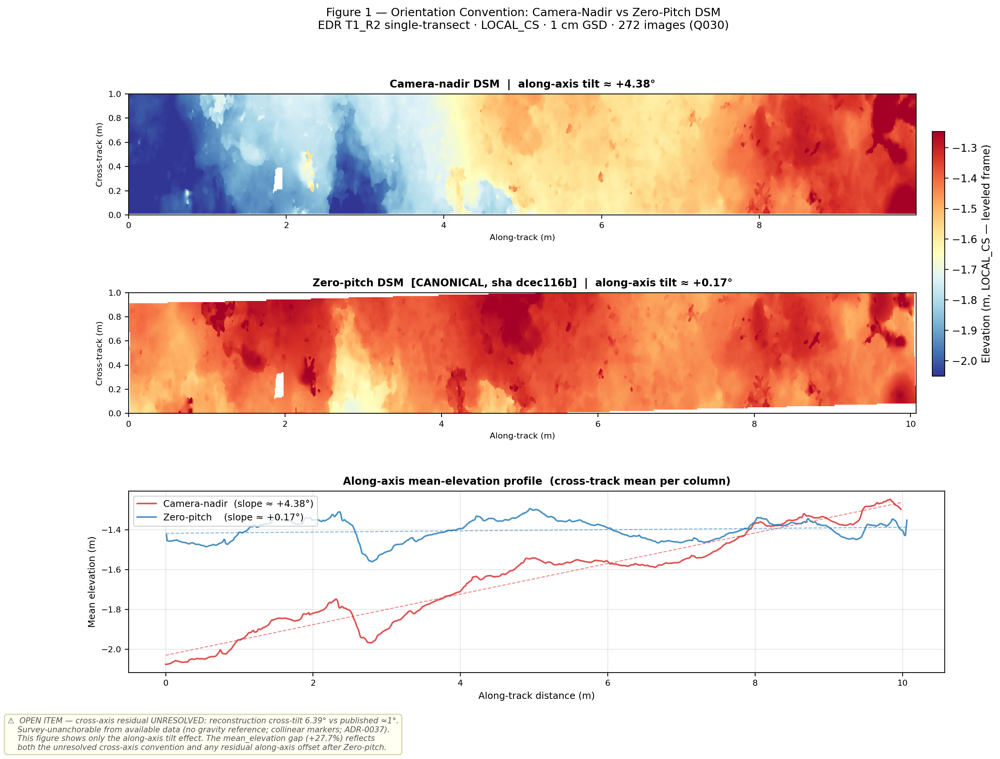
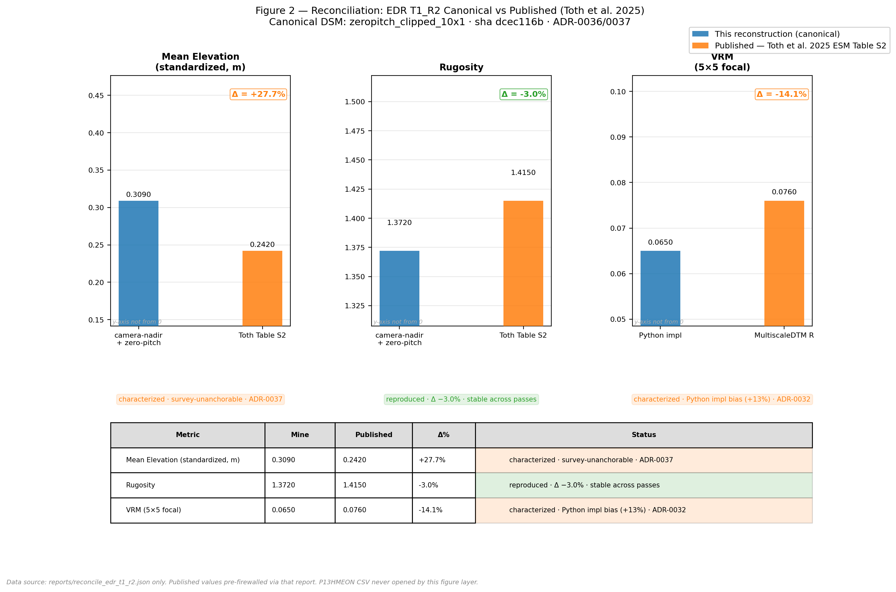

## Overview

The U.S. Geological Survey and Mote Marine Laboratory have built one of the most operationally mature Structure-from-Motion (SfM) monitoring efforts on the Florida reef tract: diver-collected imagery, a documented Agisoft Metashape workflow, and published topographic-complexity metrics tied to coral-restoration outcomes [@toth2025; @combs2021]. This project reproduces that pipeline on a single Eastern Dry Rocks belt transect (`EDR_T1_R2`) from the open imagery release [@johnson2025], and wraps it in something the published workflow does not formalize: a provenance, QC, and metric-reconciliation layer that records every processing decision, validates outputs against the published quality targets, and reconciles the reconstructed complexity metrics against the published reference values [@toth2025data] — under a strict firewall that keeps those reference values out of the pipeline.

The most useful result is not a number that matched. It is a number that didn't, and what recovering it revealed about where reproducibility actually lives.

---

## Why this project

When I started looking for a project to anchor my transition into marine science, I had a simple question: where is the actual operational work happening on coral restoration in the United States, and what data and methods are the people doing that work using? I'm coming from fifteen years in clinical research informatics — comfortable with Python, biomedical data engineering, cloud workflows, and the kind of data discipline that NIH-funded studies demand — but I am genuinely new to marine science. I wanted to learn the field by doing real work in it, not by reading about it from a distance.

The question led me to Mote Marine Laboratory, then to their published collaboration with the USGS St. Petersburg Coastal and Marine Science Center, and then to the paper that changed how I thought about the project: Toth et al. (2025), *Coral restoration can drive rapid increases in reef-accretion potential* [@toth2025]. That argument — that SfM-derived structural complexity is a more fundamental measure of restoration success than conventional monitoring — is a governance argument before it is a photogrammetry argument. If SfM becomes monitoring infrastructure, every product has to be traceable to the imagery and settings that produced it, every quality gate has to be explicit rather than tacit, and every comparison across sites or seasons has to be defensible to someone who wasn't in the room when the model was built.

I noticed, reading the papers carefully, the gap between *reproducible in principle* and *reproducible in practice*. The pipeline produces orthomosaics, digital elevation models, dense point clouds, and metrics like rugosity and fractal dimension from underwater image sets. But the operational data management around it is not formalized: no automated intake validation, processing parameters living in a brittle HTML report, quality targets stated in prose rather than checked programmatically, metric comparison something you'd script by hand every time.

I am new to marine science. I am not new to the question of what data infrastructure a serious research program needs. The gap I was seeing is the kind of thing I can genuinely contribute to.

I chose Eastern Dry Rocks: the smallest offshore site, the cleanest data case, and a reef I've visited. Christ of the Abyss sits at the edge of it.

---

## What I did

- Reproduced the documented Metashape pipeline end-to-end on `EDR_T1_R2` — alignment, bundle adjustment, scaling, error reduction, orientation, dense reconstruction, confidence filtering, and digital surface model (DSM) — from the raw imagery in P1WHKTRD [@johnson2025], using the settings published in the Electronic Supplementary Material [@toth2025].
- Built `reef_sfm_provenance`, a tested Python package that captures a run manifest, validates it against the published quality targets, and reconciles the reconstructed metrics against the published reference products.
- Reconciled three structural-complexity metrics — mean elevation, rugosity, and vector ruggedness — against the published values for the same transect, with a hard firewall preventing those reference values from influencing the reconstruction.
- Recovered, forensically, a processing decision that one published metric depended on but that no record stated — and used it as the worked example for why the provenance layer is the point.

---

## Methods

**Methodological lineage.** The reconstruction follows the protocol established by Combs et al. (2021) [@combs2021] and operationalized for these sites by Toth et al. (2025) [@toth2025]: 10 × 2 m belt transects imaged with a downward-facing Canon PowerShot S120 at 1–2 m altitude in a double-lawnmower pattern, with 3–4 coded 25 cm scale-bar targets per transect. All Metashape parameters are taken from ESM Table S2 [@toth2025] — alignment at High accuracy, key-point limit 60,000, tie-point limit 0; error reduction via the USGS automated script [@logan2022] with reconstruction-uncertainty, projection-accuracy, and reprojection-error thresholds in the published bands; dense reconstruction at High quality with mild depth filtering; DSM at 1 cm from the confidence-filtered point cloud. A Pacific NCRMP SfM SOP [@torrespulliza2024] was consulted during early scoping as a parameter cross-reference but is not the methodological basis.

**Data sources and the firewall.** Two USGS data releases are involved, and the distinction between them is load-bearing:

- **P1WHKTRD** [@johnson2025] — the raw diver imagery (CC0). This is the *only* input to the pipeline.
- **P13HMEON** [@toth2025data] — the published SfM products and topographic-complexity measurements. These are used **exclusively** as comparison targets in the reconciliation step. They never inform alignment, leveling, tuning, or any pipeline decision.

That firewall is enforced in code, not just by convention. It exists because a reproduction that quietly tunes toward the published answer reproduces nothing. Keeping the reference values out is what made a divergence a signal rather than an artifact of leakage — and, as it turned out, what made the headline finding interpretable.

**Compute.** Reconstruction ran on an AWS EC2 g6.4xlarge (NVIDIA L4) instance under Agisoft Metashape Professional 2.3.1, reproducing a workflow originally documented on Metashape v2.0. The provenance package and all authoring are local (macOS, `uv`, Python 3.12).

---

## The provenance layer

The reconstruction is the part of this project a marine lab already knows how to do. The layer wrapped around it is the contribution, and it is the deliverable I would point a reviewer at first. `reef_sfm_provenance` is a typed Python package with a command-line interface and four concerns — intake validation, a processing manifest, QC, and metric reconciliation — plus a capture-audit that turns its own discipline back on the record it produces. The organizing principle is one sentence: a record is defensible only when every value in it is tethered to a captured source, and the package is built to enforce that, including against me.

**The interface.** Everything runs from the command line; none of this is notebook glue.

```
$ reef-sfm --help
Usage: reef-sfm [OPTIONS] COMMAND [ARGS]...

  Provenance, QC, and reconciliation for reef SfM runs.

Commands:
  validate-intake   Validate an imagery intake directory (extension, duplicates, counts, hashes).
  parse-report      Parse a Metashape processing report into a run manifest.
  qc                Run structural QC against a run manifest (and the filesystem when run_dir is a folder).
  reconcile         Reconcile local metrics against published reference values (comparison-only).
  export-prov       Export W3C PROV-JSON for the run.
  report            Assemble the human-readable Markdown report from manifest + QC + reconciliation.
  inspect           Summarize a run manifest.
  acquire           Download Eastern Dry Rocks imagery from a USGS data release.
  contact-sheet     Render JPEG contact sheets for visual review.
```

(`reef-audit` is the same application under a name that reads right for the audit-facing commands; `reef-audit inspect` summarizes a manifest.)

**The data model is typed, and provenance is first-class.** The manifest is a set of Pydantic models, not a loose dict. The block that carries provenance names exactly the things a reproduction three years from now would otherwise have to reconstruct by hand:

```python
class ProvenanceBlock(BaseModel):
    input_file_hashes:     dict[str, str] | None
    output_file_hashes:    dict[str, str] | None
    ec2_instance_id:       str | None
    snapshot_ids:          list[str] | None
    license_fingerprint:   str | None
    processing_timestamps: dict[str, str] | None
    software_versions:     dict[str, str] | None
```

Metrics carry their own lineage — a `source` field that is either `"ours"` or `"published"`, so a reconciled comparison can never silently confuse the two — and every QC threshold is overridable validator configuration rather than a constant buried in code, which is what makes the layer portable to a site with different geometry.

**What it emits.** The manifest is the artifact, and it is meant to be read. Trimmed, the run record for `EDR_T1_R2` looks like this:

```yaml
transect: EDR_T1_R2
survey_date: "2023-07-11"

software:
  metashape_version: "2.3.1 build 22446"
  platform: "Linux (EC2)"
  pipeline_entry: "scripts/metashape/run_pipeline.py"

infrastructure:
  ec2_instance_type: g6.4xlarge
  ec2_region: us-east-1
  r2_ebs_snapshot: snap-0b10abc94d12b78e1
  snapshot_tag: edr_r2_postdense_filter_pre_aoi_dsm

source_imagery:
  dataset: P1WHKTRD
  citation: "Johnson et al. 2025, DOI 10.5066/P1WHKTRD"
  file_count: 272
  sha256_manifest: /data/edr_work/EDR_T1_R2_image_hashes.json

projects:
  master_q030:
    chunk_zip_sha256: 43547ec5…c019c6
    note: "Source Q030; DO NOT WRITE"

pipeline_stages:
  align_rms_pre_reduce_px: 0.1734
  reduce_tiepoints_in: 603314
  reduce_tiepoints_out: 236860
  dense_points: 47143867
  filter_points_retained: 12585711

dsm_products:
  zeropitch_clipped_10x1:
    sha256: dcec116b…8f369
    dims: 1007x100
    resolution_m: 0.01
    footprint_m: "10.07x1.00"
    canonical: true
    adr_ref: ADR-0036

reconcile_summary:
  mean_elevation_m: {ours: 0.309, published: 0.242, delta_pct: +27.7}
  rugosity:         {ours: 1.372, published: 1.415, delta_pct: -3.0}
  vrm_python:       {ours: 0.065, published_multiscaledtm: 0.076, delta_pct: -14.1}
```

Every number on this page traces back to a record like that one — the input hashes, the exact Metashape build, the instance and snapshot the run happened on, the canonical DSM's hash, the reconciliation deltas. The `DO NOT WRITE` notes on the source chunks are not decoration; they mark the artifacts the pipeline treats as read-only inputs.

**The firewall, precisely.** The reference values from P13HMEON are comparison-only, and I want to be exact about how that is enforced, because it is not an exception that fires after the fact — it is structural. The one function that can read the published table opens it read-only, returns a plain dict, and never writes anything back; its docstring and a pinned commit are the contract:

```python
def load_reference_metrics(
    path: str | Path, site: str, subsite: str, transect_id: str, filter: str
) -> dict[str, Any]:
    """Read ONE published row, keyed (site, subsite, transect_id, filter).

    READ-ONLY firewall: opens the table for reading only, returns a plain
    dict, and never writes anything back. The result is comparison data — it
    must never flow into `load_dsm` or `compute_metrics`. Raises LookupError
    if the key matches zero rows or more than one.
    """
    path = Path(path)
    with path.open(newline="") as f:  # read mode only — firewall
        ...
```

There is deliberately no path by which a published value reaches the pipeline. The invariant — *never written, never fed back into the DSM path* — lives in the module docstring alongside the commit that established it.

**It audits itself.** The last component is the capture-audit (told as a story in Session 6). Its job is to grade the *record*, not the result, against a severity-ordered taxonomy:

```python
class Liability(str, Enum):              # severity ascending
    RETIRED                = "retired"                  # threshold captured + correct
    UNCAPTURED_MEASUREMENT = "uncaptured_measurement"
    UNTETHERED_THRESHOLD   = "untethered_threshold"
    UNSOURCED_THRESHOLD    = "unsourced_threshold"
    SELF_CONFIRMING        = "self_confirming"
```

A run is `overall_conformant` only when every gate is `RETIRED`, and conformant means *capture-complete, not all-pass*. That distinction is the point: a gate can fail its threshold and still be conformant, because the record honestly shows that it failed. Keeping "is the record defensible" and "did the check pass" on separate axes is what stops a failing check from earning a green badge it didn't earn.

**Why this generalizes.** None of this is specific to Eastern Dry Rocks. The schemas are generic, the gate thresholds are configuration, and the nine commands describe any documented SfM workflow rather than this one in particular. A restoration program already producing Metashape reports could point the manifest, QC, and reconciliation tools at its own pipeline and its own published targets — which is the reason to build it as a package instead of a script.

---

## The arc — nine sessions

This project ran as nine focused work sessions over six weeks. The sessions are condensed here; the full lab-notebook record — dead ends, wrong turns, and all — lives in the [project notebook on GitHub](https://github.com/velezf/reef-sfm-mote-keys).

### Session 1–2: Infrastructure

Sessions 1 and 2 were deliberately mechanical: scaffold the repository, provision the AWS workstation, and end up with a stable compute environment before touching any data.

The AWS piece had its own operational puzzle: new AWS accounts start with a GPU vCPU quota of zero, which is not documented prominently anywhere. The quota increase for `g6` instances took three days of support-case back-and-forth. Once resolved, the license-stability question was more technically interesting. Agisoft Metashape Professional's node-locked license fingerprints against hardware identifiers — primarily the MAC address of a network interface. AWS's stop/start model creates a specific risk: if the underlying physical host changes silently, the primary ENI can get a new MAC and break the license fingerprint. The mitigation was a secondary ENI attached at device-index 1, whose MAC lives with the ENI object rather than the instance or the physical host. `start-instance.sh` verifies the MAC on every resume and bails loudly if it has changed, before Metashape ever runs.

The 30-day Metashape trial started at 2026-05-27 00:13:14 UTC. Everything compute-bound had to finish by June 27.

### Session 3: Bootstrap and activation

The full software layer on top of the AWS infrastructure — Python 3.12 via `uv`, QGIS LTR, Amazon DCV 2025.0 for GUI access, Metashape Professional 2.3.1 — was a resumable bash orchestrator with thirteen idempotent step functions. It mostly worked on first run, but DCV was its own four-hour lesson across two evenings: a missing IAM role that blocked DCV's license retrieval, a documentation note buried in the admin guide saying LightDM isn't supported with DCV on Ubuntu 20.x+, and the discovery that DCV doesn't start its own X server — it attaches to one the display manager provides. Each of these was fixable once identified. None of them were in any tutorial I'd found.

::: {.callout-note appearance="simple"}
**The Metashape Python module isn't where you expect it.** The supported invocation is `metashape.sh -r script.py`, which runs your script inside Metashape's own Python runtime. This is separate from any `uv`-managed environment and became ADR-0005 for the project.
:::

### Session 4: Data acquisition and an unexpected finding

Session 4 was supposed to be straightforward: download the EasternDryRocks imagery from USGS data release P1WHKTRD, validate it, produce an intake QC report. It turned into the longest single session of the project.

The acquisition itself was the easy part: 3,271 TIFFs from EasternDryRocks, 53.22 GiB on disk. The validation is where things got interesting.

I'd assumed the on-disk TIFFs would carry standard EXIF — exposure time, aperture, ISO, focal length, capture timestamp. They don't. USGS distributes the files as Photoshop 24.6 re-encodes of the original CR2 RAW captures; Photoshop's TIFF export strips the entire Exif sub-IFD. Every file in the dataset is missing `ExposureTime`, `FNumber`, `ISOSpeedRatings`, `FocalLength`, and `DateTimeOriginal` by design.

This is methodologically irrelevant for SfM — the workflow uses bundle adjustment with coded scale-bar targets, not EXIF priors — but it broke every assumption my validator had been written against. And it pointed at something larger.

I've spent fifteen years in biomedical informatics watching the same reproducibility problem play out across genomics, imaging, proteomics, structural biology: a method paper gets published with a prose-described preprocessing step — *"images were converted to TIFF using Adobe Photoshop"* — someone tries to reproduce the work three years later, the Photoshop version has changed, the EXIF structure is different, the comparison between old and new data silently drifts. The biomedical informatics community has largely solved this through executable, version-pinned, structurally-described workflows: CWL, WDL, Nextflow, Snakemake. When a 2018 GATK variant-calling workflow ships as a WDL file, you can run it in 2026 and get bit-identical outputs. That work took roughly fifteen years of community effort and is now the expected norm in serious computational biology.

The metadata-loss finding I surfaced in Session 4 is a specific instance of the general pattern marine SfM hasn't yet closed. Photoshop 24.6 strips the Exif sub-IFD; some future Photoshop version may strip differently. The capture timestamps that survive in the IDS CSV are there because USGS maintains a separate database — if that database schema changes between releases, downstream code breaks silently. None of these are problems for *this* dataset in isolation. All of them are problems for *comparing this dataset to a future version of itself*, which is the actual scientific question restoration monitoring is trying to answer.

The structured `metadata_lineage` section in the QC report — four-layer characterization of what Photoshop preserves and what it strips, machine-readable and schema-versioned — is what that capture looks like for one specific link in the chain. The validator iteration wasn't a detour; it was the project earning its premise.

### Session 5: T3 dress rehearsal, a 24° tilt I couldn't see

Session 5 was the core SfM processing work. I ran T8 imagery first as a smoke test to validate the headless confidence-filtering implementation (ESM Step 13 — classifying low-confidence dense-cloud points as noise — has no direct Python API equivalent; the approach required working through the API documentation rather than forum examples). Then T3 as the dress rehearsal: first scaled run, first contact with real reef geometry at production scale.

The day-1 T3 leveling came out tilted 24.26° off nadir. Not subtly — a quarter-turn of roll. I hadn't caught it because there was nothing for the eye to catch: the AlignmentHelper hardcodes roll to zero, I hadn't enabled Zero-pitch, and the roll quietly inherited from the bounding-box orientation I'd set by hand. The tool renders a leveled-looking model. Through the GUI, the error was structurally invisible — I could have stared at that orientation for an hour and approved it every time.

The fix was an independent marker-plane re-level — fitting a robust, outlier-rejecting plane to the markers, sending its normal to Z, solving roll and pitch from the data instead of from my hand on the box. I validated the result against downloaded P13HMEON reference DEMs — as a gate only, never a leveling input. The reference tells me whether I'm right; it never gets to tell me what the answer is.

AOI placement surfaced a related problem: the markers that give the correct level plane sit about 0.5 m off the actual reef band and about 2° askew to it. Using the same fiducials for both leveling and AOI framing quietly cost me coverage — from ~48% to ~97% when I switched the AOI to a footprint-derived frame. **Markers level the plane; the data footprint frames the AOI.** Don't let one reference do two jobs.

The real lesson wasn't the technique. The dangerous errors are the ones the tool hides from the eye. And the part that doesn't depend on skill at all is reproducibility: the same plane fit, the same gate, the same answer on every transect, with a record to prove it ran. That's the value that scales, and a careful hand doesn't.

T1 production followed T3 and brought its own surprises: a Z-window built on an assumption of uniform slope that a trough-to-crest reef profile violated, clipping a 10 m transect to 2.58 m before the surface-anchored correction. And two gate failures I left red — `total_tilt` at 8.71° against a 6° threshold sized for the 24° mis-level incident, not for genuinely tilted reef-wall cross-slope; `orientation_plus_x` at 135° versus the +X convention. A valid product is not a green gate. Re-leveling a correctly-leveled transect would have been falsifying the record to make it look tidy.

### Session 6: Building the provenance layer, and learning what one published metric depended on

Session 6 was the largest single arc of the project, and it ended in a place I hadn't anticipated.

**Building the layer.** `reef_sfm_provenance` is a real package — typed and tested — 427 tests, of which 424 pass on a clean clone and 3 skip because they need a product DSM kept out of version control — usable from the command line. It has four components: an intake validator that catalogs every input image with SHA-256; a processing manifest that captures input/output hashes and every parameter and software version; a QC validator with three-state semantics (pass / fail / **not-evaluable** — never collapsing the third into a pass); and a reconciliation module that computes rugosity, vector ruggedness (VRM), and standardized mean elevation per the formulas in Toth et al. 2025.

Before pointing the metrics at my reconstruction, I ran them on the *published* DSMs and compared to the *published* table values. Rugosity reproduced to under 0.3%. VRM read about +14% high against MultiscaleDTM — a Sappington-vs-MultiscaleDTM implementation offset, characterized and recorded. The instrument was validated before I trusted any reading.

**The wrong target.** Here is a basic thing I got wrong because I'd only read about the data, not handled it. I'd been treating "EDR_T1" as a transect I could match one-to-one against a published row. It isn't — it's a *subsite* of nine separate published transects. My original reconstruction was a 10×1 m center-cut from a merged area survey spanning roughly three times the relief of any single published belt. Fixing this required reconstructing a single *published* transect — R2, about 272 images — end to end. It's the only comparison that means anything, and it added real time and compute.

**The first reconcile.** Three numbers. Rugosity: −3.3%, stable and frame-robust. VRM: −24%, consistent with the sparse-coverage fidelity finding and the known implementation offset. Mean elevation: **+144%**. As a newcomer, that gap was uncomfortable. The firewall discipline meant I had to find out *why* honestly, without nudging anything toward the published value.

**Chasing the gap.** The code was sound — verified against published DSMs. The footprint was exactly 10×1 m at the raster level. So it was orientation. I measured the actual attitude of all four published EDR DSMs and the pattern was unmistakable: the along-axis is 0.14–0.23° in every one (leveled), while the cross-axis stays at 0.88–1.38° (intact). That asymmetry is the signature of the AlignmentHelper's **Zero-pitch** option, which levels the along-transect midline to horizontal and leaves the cross-slope alone.

Zero-pitch is off by default. The published methods text cites the AlignmentHelper without saying it was switched on. I could only recover that it had been by measuring the published products and reading the leveling back out of them. To an experienced SfM analyst, enabling Zero-pitch may be completely routine — the obvious thing to do — and the people who processed this data made that call. I'm not claiming a deficiency in their work. I'm saying that as a newcomer running this for the first time, a processing choice that moves a metric by a factor of more than two was invisible to me in the documentation and only recoverable from the artifact. That is precisely the distance, in clinical data, between an exclusion criterion an analyst "just knows" and one that's encoded, versioned, and auditable. Seeing it here, in a reef DSM, was the moment the whole project clicked.

I reproduced Zero-pitch on my own chunk — along-only convention, matching the published products — and the gap fell from **+144% to +32%**. A yaw artifact in the leveling rotation had widened my belt from 1.0 m to 1.18 m; re-clipping to a true 10×1 m brought mean elevation to **+27.7%**. Raw relief: 0.666 m against the published 0.670 m — a clean surface match that, with rugosity and VRM, gives three independent confirmations the surface itself is right. What remains is isolated to one axis.

**The cross-axis surprise.** My cross-axis sits at 6.39° against the published ~1°. Reasoning it through, I expected leveling to the marker plane to be the more principled choice and to pull the cross-axis toward the published value — the markers are fixed objects surveyed into the reef, and a diver swimming a 10 m transect is an unstable reference for "up." The data said the opposite. Marker-plane leveling made everything worse: mean elevation to +55.4%, cross-axis to 12.15°.

The reason is the sharper finding: the markers are nearly **collinear** — a spread ratio of 0.00085, sitting almost on a line down the transect. They pin the along-axis and the scale beautifully but carry essentially no cross or vertical information. A plane fit through points on a line is constrained in one dimension and free in the other two. My own pipeline already knew this — there's a collinear guard in the leveling code that detects exactly this pattern and falls back to camera-nadir. I had to bypass my own guard to run the experiment, and bypassing it produced precisely the regression the guard exists to prevent.

So the honest conclusion is not "my cross-slope is the real reef" and not "my cross-slope is an artifact I can fix." It's that the cross-axis reference is **unanchorable from this dataset's survey controls** — not for me, and not for the published pipeline either, whose ~1° can't have come from the markers any more than mine could.

**The audit catching me.** The last thing I built in Session 6 was a captured-threshold audit that walks every quality gate in my own pipeline and asks three questions of the *record*, not the result: Did the gate write down the threshold it judged against? Did it write down the value it actually measured? And can you tell those two apart, or is the record just echoing its own threshold back at itself?

The audit found three gaps on its first run, all mine. Two were thresholds that lived in the pipeline code but never reached the captured record — a co-registration tolerance and a footprint bound a reviewer would have to take on faith. The third was a marker-coherence gate whose "observed" value was just its own threshold copied back. It passed, but carried no information — it couldn't tell a clean result from a marginal one.

Then it flagged check 7, and this is the part I least want to gloss. Check 7 is an orientation gate — a guard meant to catch a model that's been silently flipped. On the area survey it passes. On the single transect it fails, and I'd long ago waved that failure off in my notes as a "benign convention mismatch — no product flip, don't touch it." When the audit made me justify that, I reached for the easy move: mark it *characterized* — understood, accepted — and let the dashboard go green.

Two things stopped me. The tool's part: I'd built the audit so an exemption needs a written rationale, but I'd only enforced that a rationale is *present*, not that it's *sufficient* — and the note I was about to attach described what the gate is, not why its failure was acceptable. The rest was going to disk. When I looked for the actual basis of "no product flip," there wasn't one: no recorded orientation values, no geometric argument, no visual check. I didn't characterize it away. I captured the gate's expected value so the record can defend its verdict, and I left the failure *visible* — an honest, unaccepted failure, with the orientation question written down as an open item. The audit reads "conformant" now, but only on the axis it measures: the record is complete and honest. The gate still shows red.

Keeping those two apart — is the record defensible, versus did the check pass — is the whole point. Collapsing them is exactly how a failing safety check earns a green badge it didn't earn.

### Session 7: Figures

Session 7 was originally planned as a QGIS annotation session for benthic cover. By the time I got there, two things had changed: the reconciliation unit had narrowed to the single EDR_T1_R2 transect (which has no ortho on disk), and working through the cover question convinced me to scope it out.

The published cover numbers are CoralNet point-counts: ten 1×1 m images per transect, 150 points each, every point identified by eye — ~1,500 expert benthic classifications per transect. The obvious QGIS shortcut is to trace polygons and take area fractions, but area-fraction is a different estimator than point-count, so it would diverge from the published number rather than approximate it. And the number's credibility would rest entirely on a first-time identification of staghorn versus dead colony versus CCA versus turf-on-substrate, across 1,500 points. That is coral-ecology craft outside my background and outside this project's thesis. I scoped cover out and moved automated benthic classification to its own effort — a classifier-validation problem that reuses the QC/agreement architecture built here, honestly framable despite the coral-ID gap because the contribution is the validation harness, not the biology.

What remained was scripted raster visualization and a results chart, both reproducible in Python, both landing directly in this notebook as regenerable artifacts. Two figures.

---

## The figures

### Figure 1 — orientation convention

Same transect, two leveling conventions. The along-axis tilt difference is the cause of the mean-elevation gap.

{#fig-orientation fig-align="center"}

The figure deliberately does not claim cross-axis agreement. My reconstruction's 6.39° cross-axis against the published ~1° is unresolved and annotated as an open item — survey-unanchorable from available data. The +27.7% mean-elevation gap reflects both the unresolved cross-axis convention and any residual along-axis offset after zero-pitch. I did not let a clean-looking panel imply agreement that doesn't exist.

### Figure 2 — reconciliation

Canonical values versus published (Toth et al. 2025 ESM Table S2 [@toth2025]), per metric, with reproduction status.

{#fig-reconciliation fig-align="center"}

::: {.callout-note appearance="simple"}
**On the y-axis.** Both panels use a non-zero y-axis (watermarked "y-axis not from 0"). These are tightly clustered ratios; a zero baseline would flatten every difference to invisibility. The watermark is the honest way to handle a truncated axis.
:::

---

## The reconciliation

| Metric | Mine | Published | Δ% | Status |
|---|---|---|---|---|
| Mean Elevation (standardized, m) | 0.3090 | 0.2420 | +27.7% | Characterized — survey-unanchorable cross-axis convention |
| Rugosity | 1.3720 | 1.4150 | −3.0% | **Reproduced** — stable across leveling passes |
| VRM (5×5 focal) | 0.0650 | 0.0760 | −14.1% | Characterized — Python impl bias (+13% vs MultiscaleDTM) |

**The headline: rugosity reproduces** (−3.0%, stable across the camera-nadir → zero-pitch passes — frame-robust, as expected). Mean elevation is characterized, not reproduced — the +27.7% gap traces to the unresolved cross-axis orientation convention, not to a code or footprint error. VRM is characterized — the −14.1% versus published is consistent with the known Python-implementation offset, a different comparison than the published delta but the same underlying offset. Both the mean elevation and VRM characterizations are documented decision records in the repository.

One result anchors everything: **run against the published DSMs directly, the same metric code reproduces the published values to within 0.1%.** The measurement code is correct. Whatever the table shows reflects the reconstructed *surface* and the *frame* it sits in — not the math.

---

## QC record

| Check | Published target | Observed | Outcome |
|---|---|---|---|
| Images registered | ≥ 90% of input | 131/270 (48.2%) | FAIL — corpus geometry ceiling (characterized) |
| Reprojection error (post error-reduction) | RMSE 0.27–0.52 px | 0.1397 px | PASS |
| Scale-bar error | sub-millimetre | ±4.4 mm (±1.76%) | FAIL — underwater geometry, no GCPs (characterized) |
| Markers gate A — parity | All coded IDs detected | GUI correction applied | PASS after correction |
| Markers gate B — coherence | All residuals < 2.0 px | All < 2.0 px ceiling | PASS |
| Markers gate C — consistency | Inter-bar ratio < 1.25 | 1.034 | PASS |
| Markers gate D — sufficiency | ≥ 3 validated bars | 3 bars validated | PASS |
| AOI coverage | ≥ 95% | 93.7% | BYPASSED — out-and-back trajectory |
| Belt geometry (GATE#6) | Single-pass belt | Out-and-back | BYPASSED — documented exception |
| Artifact integrity | All outputs re-hashed | 25/25 sha256 OK | PASS |

The two FAIL entries are both characterized and non-disqualifying. Registration at 48.2% reflects the out-and-back corpus geometry: 131 cameras aligned at any quality threshold — the ceiling is in the imagery overlap pattern, not the software settings. Scale-bar residual at ±4.4 mm against a 1 mm published target is consistent with underwater imaging geometry and the absence of ground control points. Neither invalidates the reconstruction; both are in the record.

---

## What I took away

**The provenance gap is real, and it shows up in a specific way.** Three times across these sessions I was confident about something in this domain and wrong: the 7.977° criterion (conflating along-axis and marker-plane tilt), the assumption that Zero-pitch was off by default, the expectation that marker-plane leveling would fix the cross-axis. Each time, a verification check caught it before it became a result. Reading about reproducibility, I understood in the abstract that verification matters. Running the pipeline myself, being wrong three times and getting caught, made it concrete.

**The dangerous errors are the ones the tool hides from the eye.** The AlignmentHelper didn't lie — it just wasn't solving roll, and rendered a leveled-looking result anyway. Through the GUI, a 24° mis-level was structurally invisible. On this class of error, no eye has earned the right to overrule the data fit and the gate.

**The most useful result is the finding that didn't match.** Zero-pitch is off by default. The published methods text cites the AlignmentHelper without saying it was switched on. A newcomer following the documentation literally would reproduce neither the leveling decision nor the metric it governs. That's not a criticism of the original work — it's an observation about where the field's documentation norms haven't kept up with its science. An experienced analyst would have known; I recovered it forensically. The difference between "the analyst knew to do it" and "the decision is encoded and auditable" is the whole of data governance, and watching it show up in a coral-reef DSM was the most personally satisfying part of the work.

**The audit catching me was the most useful lesson.** The reconciliation arc taught me this by making me the victim of choices other people never wrote down. The audit arc taught me the same thing from the other side, by catching me about to make one of my own and bury it. That second version was more useful, because the temptation was mine.

---

## What's open

- **Cross-axis orientation unverified.** The T1_R2 orientation gate (check 7) shows a captured FAILURE. The physical basis for "no product flip" has no recorded verification. This is documented as a blocker in the project's decision records with explicit verification steps.
- **Marker 25–26 label basis pending.** The physical-to-label correspondence for the far-end target pair is unconfirmed. Positions are accurate (projection residuals < 2 px); a label swap between 25 and 26 would not affect the plane fit or scale. Open item.
- **Full-area T1 DEM hang unresolved.** `buildDem` hangs on the 487M-point area-survey cloud in Metashape 2.3.1 — three confirmed runs. The transect DEM (10×1 m) is DEM-sourced per ESM Step 15; the full-area visual ortho was built point-cloud-direct as a documented exception.

---

## Technical details

| Item | Detail |
|---|---|
| Language | Python 3.12 |
| Environment | `uv` |
| SfM software | Agisoft Metashape Professional 2.3.1 |
| Compute | AWS EC2 g6.4xlarge, NVIDIA L4 |
| Key packages | `rasterio`, `numpy`, `matplotlib`, `pydantic`, `pytest` |
| Test suite | 427 tests (424 pass + 3 skip on a clean clone) |
| Version control | Git / GitHub |
| Portfolio framework | Quarto |
| Provenance package | `reef_sfm_provenance` (typed, CLI entry points) |

---

## References

::: {#refs}
:::

---

## About this project

This project is part of a portfolio in marine environmental data science, built to demonstrate reproducible analysis workflows applied to real-world reef conservation data. The full code, test suite, decision records, and environment specification are available on GitHub.

::: {.callout-tip}
## Reproducibility
All figures are static outputs committed to the repository — generated from DSMs and a pre-firewalled reconciliation report, reproducible from a fresh clone of the source repo. The provenance package includes a `capture_audit` module that verifies the completeness of every quality gate's recorded evidence.
:::

[View source repo](https://github.com/velezf/reef-sfm-mote-keys){.btn .btn-outline-primary}
[USGS imagery release (P1WHKTRD)](https://doi.org/10.5066/P1WHKTRD){.btn .btn-outline-secondary}
[Archived v1.0 — Zenodo](https://doi.org/10.5281/zenodo.20835765){.btn .btn-outline-secondary}
